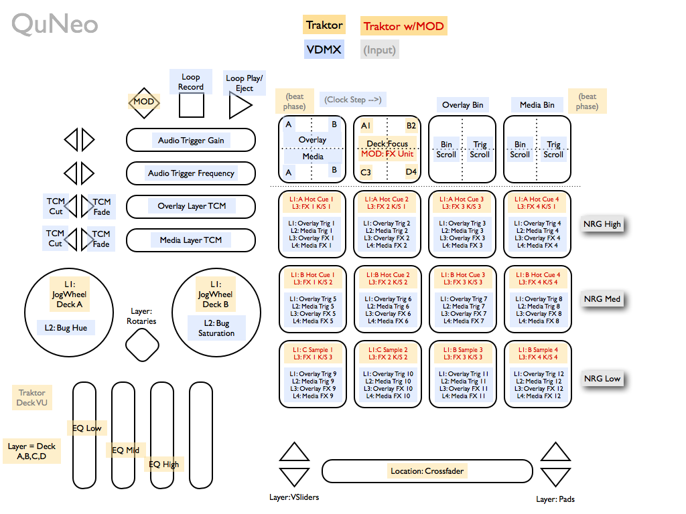
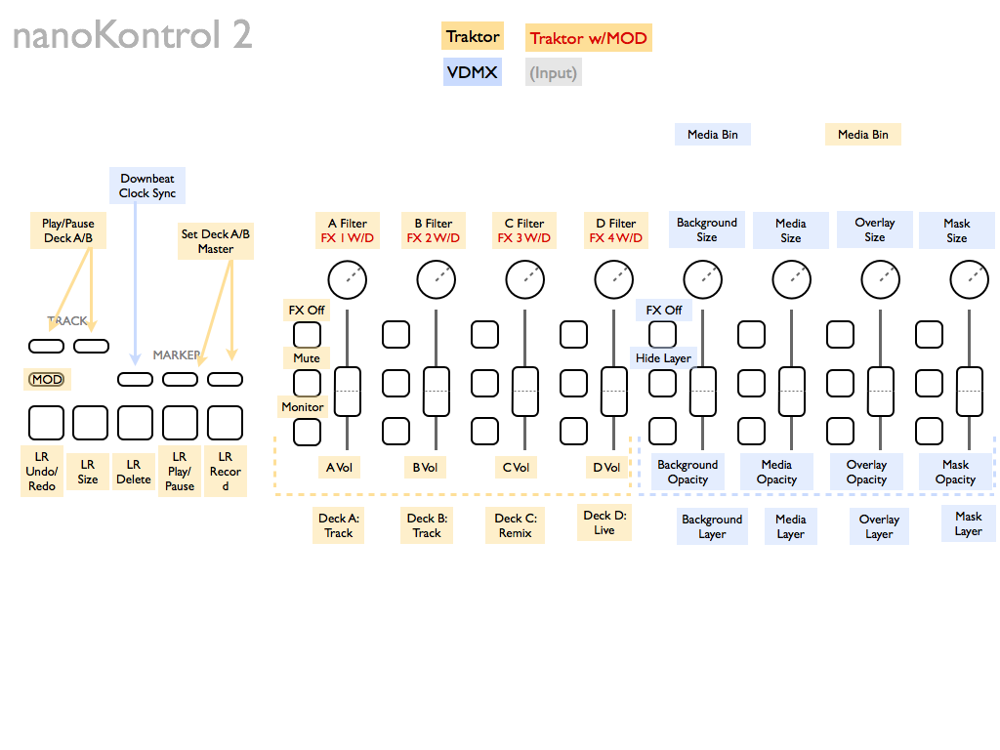
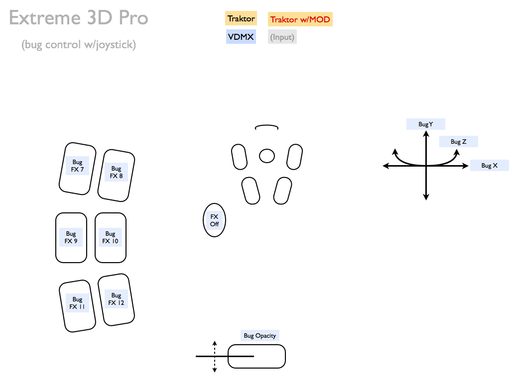

# README

Mapping [Traktor](http://www.native-instruments.com/) and [VDMX](http://www.vidvox.net) to external hardware and software controllers. Very much an experimental work-in-progress.

## Why? (why not?)

Needing to simultaneously control DJ and VJ software is a curious problem to have. This was interesting enough that I wanted to throw what controller hardware and software was at hand at it and see what sort of master layout emerged.

For now I'm only posting the mapping overlays as I'm testing them out, not the device mappings, quartz patches, or Traktor/VDMX files.

## Currently Mapped

* [QuNeo](http://www.keithmcmillen.com/) MIDI control surface
* [nanoKontrol2](http://www.korg.com/nanoseries2) MIDI faders
* [Extreme 3D Pro](http://gaming.logitech.com/en-us/product/extreme-3d-pro-joystick) HID joystick for the video bug (using a Quartz Composer patch to map some buttons to remappable MIDI)

## Future (ie controllers I have on hand)…

* [Lemur](http://www.liine.net) MIDI/OSC software for anything 'left over' and for status displays
* [Nostromo SpeedPad n52](http://en.wikipedia.org/wiki/Nostromo_SpeedPad_n52) HID keypad, gathering dust without any functional drivers anymore
* [mini32](http://www.m-audio.com/products/en_us/KeystationMini32.html) MIDI keyboard, great for clip triggers
* [Leap Motion](http://leapmotion.com/) if it ever shows up.
* ... and whatever else I can get my hands on. Just because.
* Momentary camera input (motion detection qtz for gestures, as a color picker, etc?)

## More
**License as applicable:** Please distribute. Please improve. Credit me if you fork and/or distribute. Above all, distribute and improve on this template ([CC-BY](http://creativecommons.org/licenses/by/3.0/)).

---

